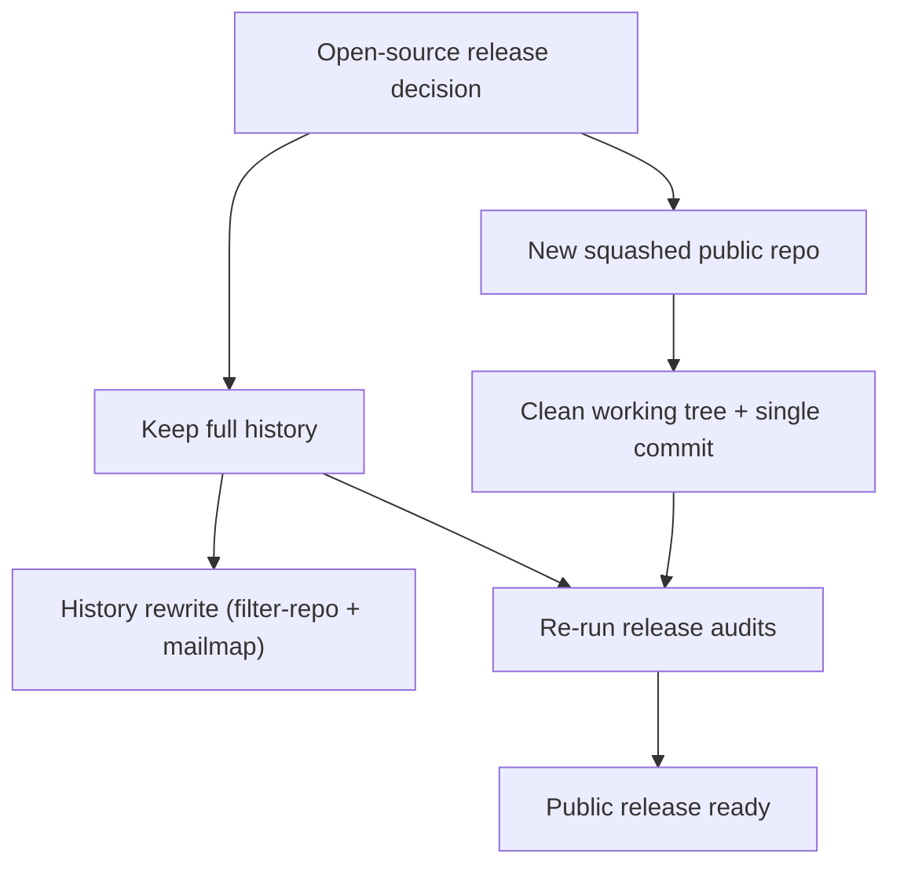

# Open-Source Readiness Report (2026-02-22)

Scope: `claude-orchestrator` repository, current `main` lineage.

## Executive Summary
- The current working tree passes the non-history public-release audit, including loopback network defaults and public-doc path hygiene.
- The full git history is still not clean for a public release because historical artifacts remain and author/committer emails are embedded in commit metadata.
- The history secret scan currently fails due to a test fixture string flagged as a generic API key in `tests/unit/auditExportService.test.js`.
- A clean public release requires choosing one of two strategies: publish a new squashed public repo or perform a controlled history rewrite.

## Evidence Reviewed
- `PUBLIC_RELEASE_AUDIT_2026-02-04.md` (original security review)
- `PUBLIC_RELEASE_AUDIT_2026-02-05.md` (updated audit after hardening)
- `PUBLIC_RELEASE_AUDIT_2026-02-06.md` (repeatable audit + commands)
- `PLANS/2026-02-05/HISTORY_REWRITE_PRIVACY_EMAILS_PLAN.md`
- `SECURITY.md`, `CONTRIBUTING.md`
Automated checks run on 2026-02-22:
- `npm run audit:public-release` (pass)
- `npm run audit:public-release:history` (fail: gitleaks flagged a test fixture)

## Prior Audits Summary
| Date | Key Findings | Status in Current `main` |
| --- | --- | --- |
| 2026-02-04 | Tracked diff-viewer DB, permissive CORS, LAN bind defaults, doc path fingerprints, test artifact in history, commit emails in history | Network defaults and tracked artifacts in HEAD are now fixed; history items and emails remain |
| 2026-02-05 | Confirmed loopback defaults; history still contains `diffs.db` + `test-results/.last-run.json`; emails in history; internal docs naming | Still true; requires history rewrite or squashed repo |
| 2026-02-06 | Same as 02-05, with repeatable commands; additional hygiene notes | Still true; history rewrite plan exists |

## Current Findings

### 1) History artifacts remain in git history
- `diff-viewer/cache/diffs.db` appears in history (example commits: `e44be7d`, `f039a57`, `7884629`).
- `test-results/.last-run.json` appears in history (example commits: `e44be7d`, `8727f64`).
- These are removed from HEAD but remain public if the full history is published.

### 2) Commit metadata contains personal emails
- Prior audits confirm at least one non-noreply email in commit metadata.
- This is public if full history is published.

### 3) History secret scan fails due to a fixture
- `npm run audit:public-release:history` fails with gitleaks detecting a generic API key pattern.
- Finding: `tests/unit/auditExportService.test.js` at commit `a167a7bd` (fixture string, not a real key).

### 4) Internal-doc fingerprints
- Original audit noted `/home/<user>/...`, `/home/<user>/...`, and Windows paths in non-public docs.
- Public-doc audit passes, but internal planning docs still contain personal path fingerprints.

### 5) Network defaults are safe
- Orchestrator and diff viewer bind to loopback by default, and diff viewer CORS is disabled by default.
- This was confirmed in the updated audits and passes the current public-release audit.

## Recommendations

### A) Recommended path for a clean public release
- Publish a new public repo with a single squashed commit from a cleaned working tree.
- Keep the private repo as the development history source.
- This avoids rewriting history and removes historical artifacts and emails in one step.

### B) If you must keep full history public
- Follow `PLANS/2026-02-05/HISTORY_REWRITE_PRIVACY_EMAILS_PLAN.md` exactly.
- Remove historical artifacts (`diff-viewer/cache/diffs.db`, `test-results/.last-run.json`).
- Rewrite author/committer emails to GitHub noreply.
- Re-run `npm run audit:public-release:history` after the rewrite.

### C) Resolve the gitleaks fixture failure
- Update `.gitleaksignore` to allowlist the known fixture detection for `tests/unit/auditExportService.test.js`.
- Or change the fixture to a clearly non-secret token format that does not trip gitleaks.

### D) Decide what documentation is public
- Keep only public-facing docs in the public repo.
- Move internal planning docs (PLANS, internal workflow notes) to a private companion repo, or sanitize them.

### E) Use the release readiness tooling as a gate
- Run `npm run audit:public-release` on every release candidate.
- Run `npm run audit:public-release:history` before any public history release.
- Use `npm run report:release-readiness` for a consolidated status report.

## Mini-Step Action Plan
1. Decide: squashed public repo or full history rewrite.
2. Sanitize any docs intended for public release.
3. Resolve gitleaks fixture failure.
4. Run `npm run audit:public-release` and `npm run audit:public-release:history`.
5. Publish the cleaned snapshot or rewrite history and force-push.

## Readiness Decision Flow

