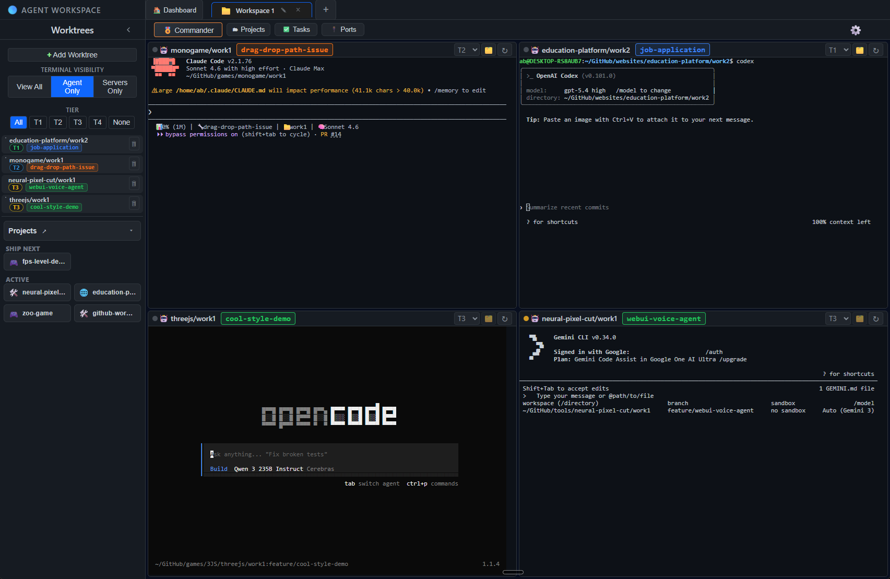
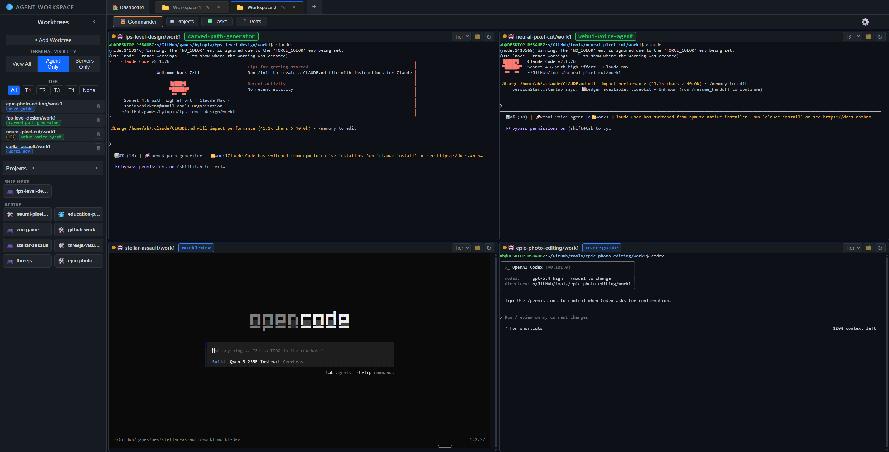
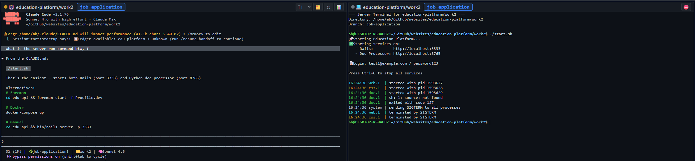
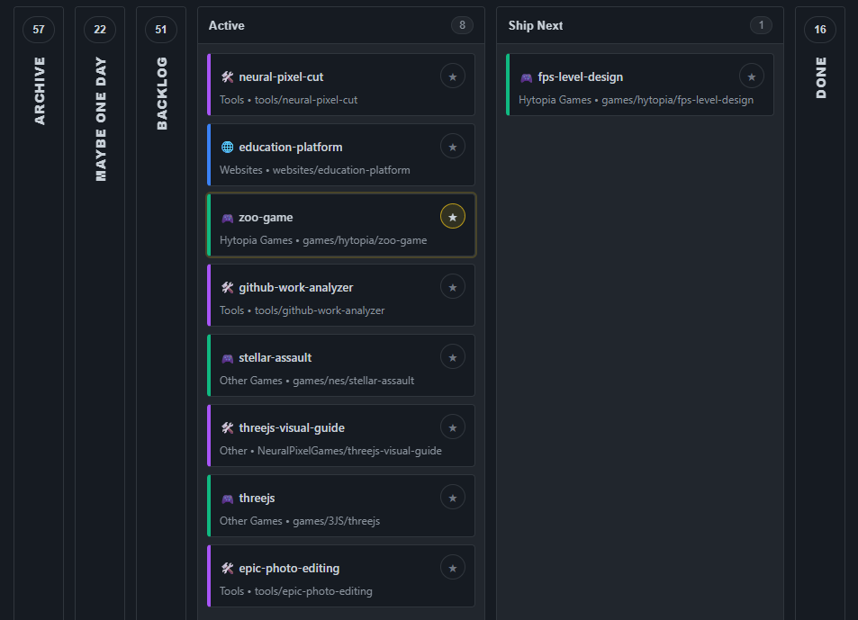
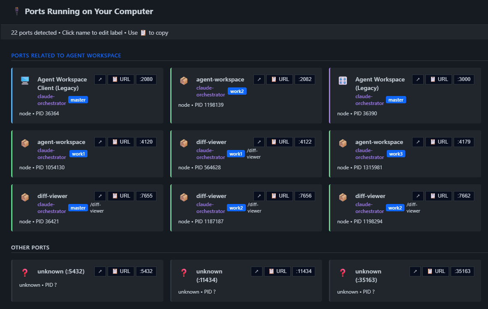
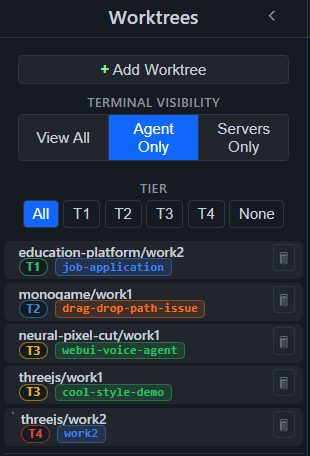

# Agent Workspace

[](https://agent-workspace.ai)
[](https://github.com/web3dev1337/agent-workspace/releases/latest)
[](https://x.com/AIOnlyDeveloper)
[](LICENSE)

All your Agents. One Workspace.

Run multiple CLI agents in parallel across different repos. Your hardware, your plans, your API keys. No publisher-hosted telemetry by default.

## Product Screenshots

### Hero



### Multi-Workspace Tabs



### Agent + Server Windows



### Projects Board



### Ports Panel



## A GUI for your TUIs

Agent Workspace wraps your preferred terminal tools and runs them side by side with your existing plans and API keys. Your credentials never leave your machine.

**Supported agents:**
- Claude Code
- Codex CLI
- Gemini CLI
- OpenCode
- Any CLI agent that runs in a terminal

**Works with:** Claude Max, Codex plans, or your own API keys.

## Features

- **Workspaces & Worktrees** — Group git repos into workspaces. Run multiple worktrees side by side with different branches, different repos, same view.
- **Native Terminals** — Real terminal sessions, not a wrapper or emulator. CLI tools run exactly as they would in your shell.
- **Tier System (T1-T4)** — Organize sessions by priority. T1 Focus for active deep work, T2 Backup runs alongside or when T1 is blocked, T3 Background for batch prompt and batch review, T4 Overnight for long-running autonomous tasks.
- **Commander** — A top-level AI that controls the interface. Send commands to any terminal, launch agents, pull tasks from your board.
- **Built-in Diff Viewer** — Review pull requests with a full code review tool without leaving your workspace.
- **Task Integration** — Pull tasks from Trello and/or use local task records. GitHub Issues and Linear coming soon.
- **Browser-like Tabs** — Multiple workspaces open simultaneously, each with its own terminals and state.
- **Runs Locally** — Runs on your hardware. Access through the desktop app or the browser. No publisher-hosted telemetry by default.
- **Windows Desktop App** — Native Tauri app with bundled Node.js. Mac app coming soon.

## Tier System

Keep work organized by priority with a dedicated tier lane (T1-T4), plus quick filters to isolate focus work, reviews, and background tasks from the same worktree sidebar.

- **T1 Focus** — Active deep work.
- **T2 Backup** — Runs alongside or when T1 is blocked.
- **T3 Background** — Batch prompt and batch review.
- **T4 Overnight** — Long-running autonomous tasks.



## Install

### Windows

[Download the latest release](https://github.com/web3dev1337/agent-workspace/releases/latest) — the app bundles everything, no dev tools needed.

Before running the installer, verify the published SHA-256 digest on the GitHub release. If a code-signing signature is present, verify that too. If verification fails, do not run the file.

```powershell
Get-FileHash .\downloaded-file.exe -Algorithm SHA256
Get-AuthenticodeSignature .\downloaded-file.exe
```

Or run from source:

```bash
git clone https://github.com/web3dev1337/agent-workspace.git
cd agent-workspace && npm install
npm start
```

### Mac / Linux / WSL

```bash
git clone https://github.com/web3dev1337/agent-workspace.git
cd agent-workspace && npm install
npm start
```

Opens at `http://localhost:9461` in your browser.

### Prerequisites

- **Node.js** v18+
- **Git**

Optional: GitHub CLI (`gh`) for PR workflows, Rust + Cargo for building the desktop app.

On first launch, the diagnostics panel checks what's installed and offers one-click repairs.

## First Time Setup

1. Launch the app (web or desktop)
2. The dashboard shows available workspaces
3. Click **"Create New"** to open the workspace wizard
4. The wizard auto-scans `~/GitHub/` for git repos
5. Pick a repo, set terminal count, and create
6. Your workspace is ready — terminals spawn automatically

## Configuration

Default ports: server `9460`, UI `9461`, diff viewer `9462`. Override with a `.env` file:

```env
ORCHESTRATOR_PORT=9460
CLIENT_PORT=9461
DIFF_VIEWER_PORT=9462
```

## For Contributors

See [CODEBASE_DOCUMENTATION.md](CODEBASE_DOCUMENTATION.md) for architecture, service modules, and development setup.

See [CONTRIBUTING.md](CONTRIBUTING.md) for the development workflow.

## CI / CD

- **`tests.yml`** — Unit tests on every push
- **`gitleaks.yml`** — Secret scanning on every push
- **`windows.yml`** — Windows tests + Tauri build (on tags or manual dispatch)

## Security

See [SECURITY.md](SECURITY.md) for reporting vulnerabilities.

## Legal

- [Terms of Use](docs/legal/TERMS_OF_USE.md)
- [Privacy Policy](docs/legal/PRIVACY_POLICY.md)
- [Windows Installer Terms](docs/legal/WINDOWS_INSTALLER_EULA.txt)

## License

[MIT](LICENSE)
