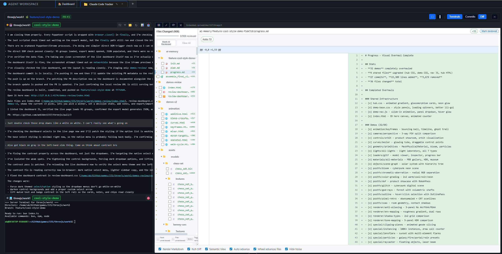

# Agent Workspace

[](https://agent-workspace.ai)
[](https://github.com/web3dev1337/agent-workspace/releases/latest)
[](https://github.com/sponsors/web3dev1337)
[](https://x.com/AIOnlyDeveloper)
[](LICENSE)

All your Agents. One Workspace.

Run multiple CLI agents in parallel across different repos. Your hardware, your plans, your API keys. No publisher-hosted telemetry by default.

## What Agent Workspace Is

Agent Workspace is a local-first orchestration layer for CLI coding agents.

- **Control plane for agent CLIs** — Run Claude Code, Codex CLI, Gemini CLI, OpenCode, and other terminal-based agents in one UI.
- **Multi-repo and multi-worktree execution** — Keep multiple repositories and branches active side by side.
- **Review + runtime workflow** — Pair agent windows with server windows, then jump directly to GitHub diffs and PRs.

## Runs Locally vs Models by Provider

- **Runs locally:** sessions, workspaces, worktrees, orchestration state.
- **Runs via provider accounts:** model inference through your selected AI CLI/provider accounts.
- **No platform-managed model relay:** you choose provider and account context.

## Quick Answers

- **Does Agent Workspace run locally?** Yes, orchestration and sessions run on your machine.
- **Can I use multiple repositories at once?** Yes, one workspace can include one or many repositories.
- **Can I run server processes in the same worktree?** Yes, agent and server windows can run side by side.
- **Can I jump straight to GitHub review pages?** Yes, the review flow supports direct links to GitHub PRs and diffs.
- **Does anyone actually use this?** Yes. We built it over a few days in July 2025 and have used it ever since to ship websites and multiple games, with more than half a million plays across those projects. We have not opened an IDE since.

## Discovery Files

- Website AI index: [agent-workspace.ai/llms.txt](https://agent-workspace.ai/llms.txt)
- Extended AI index: [agent-workspace.ai/llms-full.txt](https://agent-workspace.ai/llms-full.txt)

## Product Screenshots

### Main Workspace View


### Multi-Workspace Tabs


### Agent + Server Windows


### Diff Viewer + Review Console

Review diffs with the agent pane, server pane, and in-app diff viewer visible in one workflow, then jump straight to the GitHub PR or diff when needed.



### Projects Board


### Ports Panel


## A GUI for your TUIs

Agent Workspace wraps your preferred terminal tools and runs them side by side with your existing plans and API keys. Your credentials never leave your machine.

**Supported agents:**
- Claude Code
- Codex CLI
- Gemini CLI
- OpenCode
- Grok CLI
- Any CLI agent that runs in a terminal

Compatibility rule: if it can be launched from a terminal command in your worktree, Agent Workspace can run it.

**Works with:** Claude Max, Codex plans, or your own API keys.

## Features

- **Workspaces & Worktrees** — Group git repos into workspaces. Run multiple worktrees side by side with different branches, different repos, same view.
- **Native Terminals** — Real terminal sessions, not a wrapper or emulator. CLI tools run exactly as they would in your shell.
- **Tier System (T1-T4)** — Organize sessions by priority. T1 Focus for active deep work, T2 Backup runs alongside or when T1 is blocked, T3 Background for batch prompt and batch review, T4 Overnight for long-running autonomous tasks.
- **Commander** — A top-level AI that controls the interface. Send commands to any terminal, launch agents, pull tasks from your board.
- **Built-in Diff Viewer** — Review pull requests with a full code review tool without leaving your workspace.
- **Task Integration** — Pull tasks from Trello and/or use local task records. GitHub Issues and Linear coming soon.
- **Browser-like Tabs** — Multiple workspaces open simultaneously, each with its own terminals and state.
- **Runs Locally** — Runs on your hardware. Access through the desktop app or the browser. No publisher-hosted telemetry by default.
- **Desktop Apps** — Windows and native Linux desktop builds are published on the latest GitHub release. macOS users should run from source until the signed Apple desktop release path is restored.

## Tier System

Keep work organized by priority with a dedicated tier lane (T1-T4), plus quick filters to isolate focus work, reviews, and background tasks from the same worktree sidebar.

- **T1 Focus** — Active deep work.
- **T2 Backup** — Runs alongside or when T1 is blocked.
- **T3 Background** — Batch prompt and batch review.
- **T4 Overnight** — Long-running autonomous tasks.


## Install

### Windows

[Download the latest release](https://github.com/web3dev1337/agent-workspace/releases/latest) and grab the `.exe` or `.msi` installer — the app bundles everything, no dev tools needed.

Before running the installer, verify the published SHA-256 digest on the GitHub release. If a code-signing signature is present, verify that too. If verification fails, do not run the file.

```powershell
Get-FileHash .\downloaded-file.exe -Algorithm SHA256
Get-AuthenticodeSignature .\downloaded-file.exe
```

### macOS

Packaged macOS downloads are temporarily unavailable while Apple signing and notarization are being configured. For now, run Agent Workspace from source:

```bash
git clone https://github.com/web3dev1337/agent-workspace.git
cd agent-workspace
npm install
npm start
```

Maintainers: see [docs/MACOS_SIGNING_RELEASE_CHECKLIST.md](docs/MACOS_SIGNING_RELEASE_CHECKLIST.md) before publishing the next macOS desktop release.

### Linux / WSL

Native Linux desktop builds are published on the latest GitHub release. Download the `.deb` or `.pkg.tar.zst` package for your distro. If you are using WSL or prefer the browser workflow, run Agent Workspace from source:

```bash
git clone https://github.com/web3dev1337/agent-workspace.git
cd agent-workspace
npm install
npm start
```

Opens at `http://localhost:9461` in your browser.

### Prerequisites

- **Node.js** v18+
- **Git**

Optional: GitHub CLI (`gh`) for PR workflows, Rust + Cargo for building the desktop app.

On first launch, the diagnostics panel checks what's installed and offers one-click repairs.

## First Time Setup

1. Launch the app (web or desktop)
2. The dashboard shows available workspaces
3. Click **"Create New"** to open the workspace wizard
4. The wizard auto-scans `~/GitHub/` for git repos
5. Pick a repo, set terminal count, and create
6. Your workspace is ready — terminals spawn automatically

## Configuration

Default ports: server `9460`, UI `9461`, diff viewer `9462`. Override with a `.env` file:

```env
ORCHESTRATOR_PORT=9460
CLIENT_PORT=9461
DIFF_VIEWER_PORT=9462
```

## For Contributors

See [CODEBASE_DOCUMENTATION.md](CODEBASE_DOCUMENTATION.md) for architecture, service modules, and development setup.

See [CONTRIBUTING.md](CONTRIBUTING.md) for the development workflow.

## CI / CD

- **`tests.yml`** — Unit tests on every push
- **`gitleaks.yml`** — Secret scanning on every push
- **`windows.yml`** — Windows tests + Tauri build (on tags or manual dispatch)

## Security

See [SECURITY.md](SECURITY.md) for reporting vulnerabilities.

## Legal

- [Terms of Use](docs/legal/TERMS_OF_USE.md)
- [Privacy Policy](docs/legal/PRIVACY_POLICY.md)
- [Windows Installer Terms](docs/legal/WINDOWS_INSTALLER_EULA.txt)

## License

[MIT](LICENSE)

## Coming Soon

Productivity workflows, agent orchestration, and human context management tools built to help you ship.
