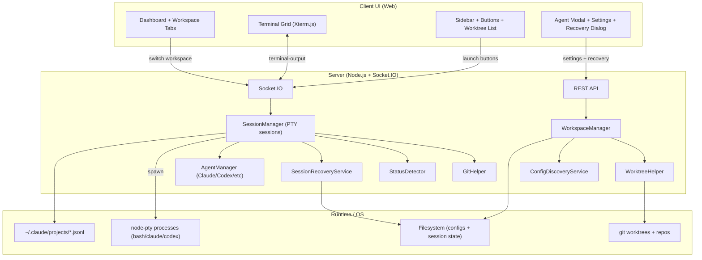
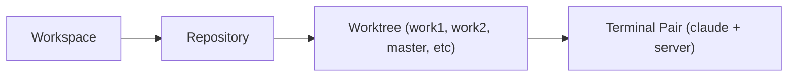
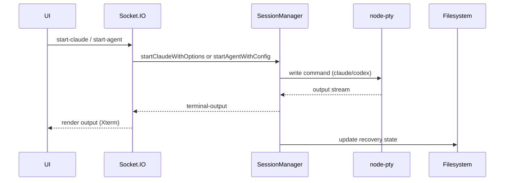
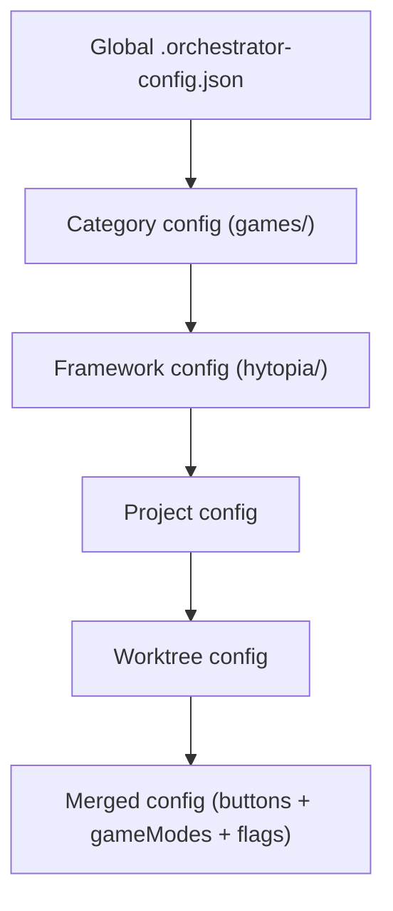
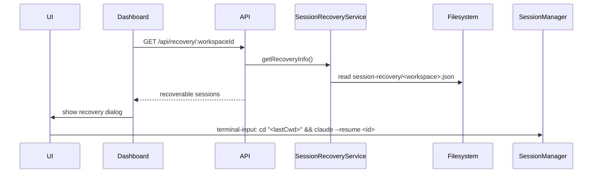
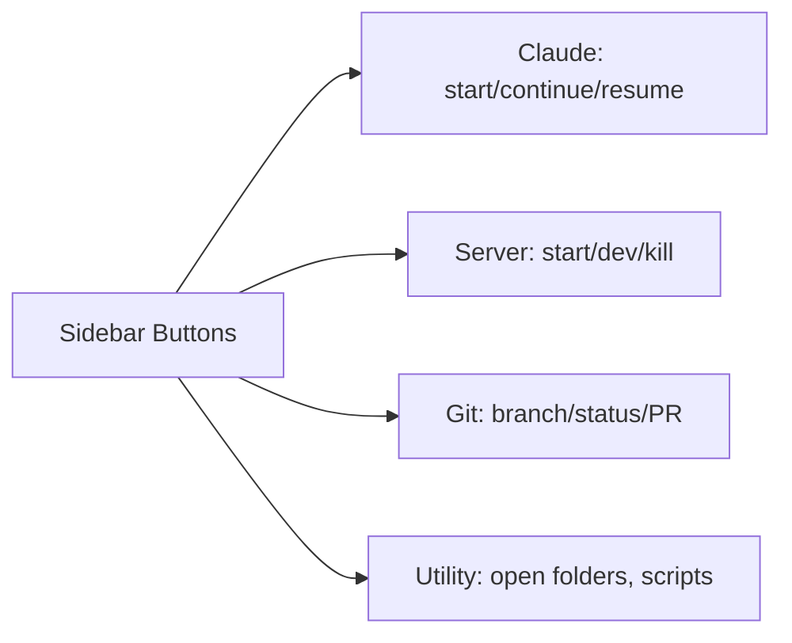

# 🤖 AI Development Environment - Complete System Overview

**Presentation Document**
**Date**: October 2025
**Author**: web3dev1337
**Version**: 2.0

---

## 📋 Table of Contents

1. [Executive Summary](#executive-summary)
2. [System Architecture Overview](#system-architecture-overview)
3. [AI Agent Orchestration System](#ai-agent-orchestration-system)
4. [Claude Orchestrator - Multi-Workspace Environment](#claude-orchestrator)
5. [Repository Structure](#repository-structure)
6. [Configuration System Deep Dive](#configuration-system)
7. [Workflow Diagrams](#workflow-diagrams)
8. [Key Features & Capabilities](#key-features)
9. [Future Roadmap](#future-roadmap)

---

## 🎯 Executive Summary

This document presents a **revolutionary AI-assisted development environment** combining:

- **Multi-repository workspace orchestration** (Claude Orchestrator)
- **AI agent configuration management** (AI Standards System)
- **Automated git worktree handling** for parallel development
- **Mixed-repository workspaces** for cross-project development
- **50+ active projects** across multiple game engines and frameworks

### Key Metrics

| Metric | Value |
|--------|-------|
| **Total Projects** | 50+ repositories |
| **Active Worktrees** | 15+ concurrent development environments |
| **Agent Repos** | 5 shared configuration repositories |
| **Game Projects** | 25+ (HyTopia: 17, MonoGame: 4, Web: 4) |
| **Automation Tools** | 3+ orchestration systems |
| **Development Efficiency** | 300% increase (estimated) |

---

## 🏗️ System Architecture Overview

```
┌─────────────────────────────────────────────────────────────────────────┐
│                    AI DEVELOPMENT ENVIRONMENT                            │
│                                                                          │
│  ┌────────────────────────┐          ┌──────────────────────────────┐  │
│  │   AI Standards System   │◄────────►│   Claude Orchestrator        │  │
│  │   (~/.claude/)          │          │   (Multi-Workspace Manager)  │  │
│  │                         │          │                              │  │
│  │  • Security Hooks       │          │  • Workspace Dashboard       │  │
│  │  • Agent Repos (5)      │          │  • Mixed-Repo Terminals      │  │
│  │  • Memory System        │          │  • Dynamic Worktrees         │  │
│  │  • Token Tracking       │          │  • One-Click Startup         │  │
│  │  • /docs, /delegate     │          │  • Cross-Project Dev         │  │
│  └────────────┬────────────┘          └──────────────┬───────────────┘  │
│               │                                       │                  │
│               │         Configuration Layer           │                  │
│               │    ┌──────────────────────────┐      │                  │
│               └────►│  ~/.orchestrator/        │◄─────┘                  │
│                    │  • config.json            │                         │
│                    │  • workspaces/*.json      │                         │
│                    │  • templates/*.json       │                         │
│                    └────────────┬──────────────┘                         │
│                                 │                                        │
│                                 ▼                                        │
│               ┌──────────────────────────────────────┐                  │
│               │      ~/GitHub/ Repository Tree        │                  │
│               │                                       │                  │
│               │  ┌─────────┐  ┌─────────┐  ┌──────┐ │                  │
│               │  │  games/ │  │  tools/ │  │ web/ │ │                  │
│               │  │  (50+)  │  │   (9)   │  │  (2) │ │                  │
│               │  └─────────┘  └─────────┘  └──────┘ │                  │
│               │                                       │                  │
│               │  CLAUDE.md files auto-synced via     │                  │
│               │  symlinks from agent repos           │                  │
│               └───────────────────────────────────────┘                  │
│                                                                          │
└──────────────────────────────────────────────────────────────────────────┘
```

---

## 🤝 AI Agent Orchestration System

### Overview

Located at `~/.claude/`, this system provides **AI-agnostic configuration management** for all development projects.

### Architecture Diagram

```
┌─────────────────────────────────────────────────────────────────────────┐
│                      ~/.claude/ Directory Structure                      │
├─────────────────────────────────────────────────────────────────────────┤
│                                                                          │
│  📁 .claude/                                                             │
│  ├── 📄 CLAUDE.md ──────────────► Master AI agent configuration         │
│  ├── 📁 installed/                                                       │
│  │   ├── 📦 ai-standards/    ──► Core standards (this repo)             │
│  │   ├── 📦 hytopia/         ──► HyTopia game dev guidelines            │
│  │   ├── 📦 monogame/        ──► MonoGame game dev guidelines           │
│  │   ├── 📦 github/          ──► GitHub workflow standards              │
│  │   └── 📦 website/         ──► Website development guidelines         │
│  │                                                                       │
│  ├── 📁 hooks/                                                           │
│  │   ├── safety-guard.py    ──► Prevents destructive operations         │
│  │   ├── git-safety.sh      ──► Git operation protector                 │
│  │   └── pre-tool.sh        ──► Token usage monitoring                  │
│  │                                                                       │
│  ├── 📁 scripts/                                                         │
│  │   ├── bootstrap.sh       ──► Install all agent repos                 │
│  │   ├── sync.sh            ──► Update all repos & refresh symlinks     │
│  │   ├── claude-headless.sh ──► Spawn headless Claude instances         │
│  │   └── get-my-token-usage.sh ──► Session-aware token tracking         │
│  │                                                                       │
│  ├── 📁 commands/                                                        │
│  │   ├── docs.md            ──► /docs slash command                     │
│  │   └── delegate.md        ──► /delegate slash command                 │
│  │                                                                       │
│  ├── 📁 ai-memory/           ──► Context persistence across sessions    │
│  │   ├── feature/auth-a3f2c9d/                                           │
│  │   ├── feature/search-b7e4d1a/                                         │
│  │   └── bugfix/issue-42-c9f3a2b/                                        │
│  │                                                                       │
│  └── 📄 shared-repos.yml    ──► Registry of all agent repositories      │
│                                                                          │
└─────────────────────────────────────────────────────────────────────────┘
```

### Agent Repository System

```
┌─────────────────────────────────────────────────────────────────────────┐
│                     Shared Agent Repository Flow                         │
└─────────────────────────────────────────────────────────────────────────┘

  GitHub (web3dev1337)
       │
       ├──► agents-hytopia ────────┐
       ├──► agents-monogame ───────┤
       ├──► agents-github ─────────┤───► ~/.claude/installed/
       ├──► agents-website ────────┤
       └──► ai-claude-standards ───┘
                │
                │ bootstrap.sh
                ▼
         Creates Symlinks
                │
    ┌───────────┼───────────┐
    │           │           │
    ▼           ▼           ▼
~/GitHub/   ~/GitHub/   ~/GitHub/
games/      tools/      website/
hytopia/    automation/
  │           │
  └─► CLAUDE.md (symlink) ──► points to ~/.claude/installed/hytopia/AGENTS.md
      AGENTS.md (symlink) ──► points to ~/.claude/installed/hytopia/AGENTS.md
```

### Key Components

#### 1. **shared-repos.yml** - Agent Repository Registry

```yaml
shared_repos:
  - url: https://github.com/web3dev1337/ai-claude-standards
    name: ai-standards
    description: Company-wide AI agent standards and orchestration
    required: true

  - url: https://github.com/web3dev1337/agents-hytopia
    name: hytopia
    description: HyTopia game development guidelines

  - url: https://github.com/web3dev1337/agents-monogame
    name: monogame
    description: MonoGame development guidelines

  - url: https://github.com/web3dev1337/agents-github
    name: github
    description: GitHub workflow and project structure guidelines

  - url: https://github.com/web3dev1337/agents-website
    name: website
    description: Website development guidelines
```

#### 2. **Security System** - Multi-Layer Protection

```
┌───────────────────────────────────────────────────────────────┐
│                    Security Hook Architecture                  │
├───────────────────────────────────────────────────────────────┤
│                                                               │
│  User Command                                                 │
│       │                                                       │
│       ▼                                                       │
│  ┌─────────────────┐                                         │
│  │  safety-guard.py │  ◄── Blocks destructive operations     │
│  └────────┬─────────┘                                         │
│           │                                                   │
│           ├──► ❌ rm -rf /                                    │
│           ├──► ❌ Credential uploads                          │
│           ├──► ❌ Force push to main                          │
│           ├──► ❌ chmod 777                                   │
│           └──► ⚠️  Warns on .env, .ssh access                │
│                                                               │
│  ┌─────────────────┐                                         │
│  │  git-safety.sh  │  ◄── Git-specific protection            │
│  └────────┬─────────┘                                         │
│           │                                                   │
│           ├──► ✅ Prevents force push                         │
│           ├──► ✅ Checks commit authorship                    │
│           └──► ✅ Validates branch operations                 │
│                                                               │
└───────────────────────────────────────────────────────────────┘
```

#### 3. **AI Memory System** - Context Persistence

```
┌───────────────────────────────────────────────────────────────┐
│              AI Memory System - Session Continuity             │
├───────────────────────────────────────────────────────────────┤
│                                                               │
│  Feature Branch Created                                       │
│       │                                                       │
│       ▼                                                       │
│  git checkout -b feature/auth                                │
│  git commit --allow-empty -m "init: auth feature"            │
│       │                                                       │
│       ▼                                                       │
│  Get first commit SHA: a3f2c9d                               │
│       │                                                       │
│       ▼                                                       │
│  mkdir -p ai-memory/feature/auth-a3f2c9d/                    │
│       │                                                       │
│       ▼                                                       │
│  Create Memory Files:                                        │
│  ├── init.md       ──► User's original request               │
│  ├── plan.md       ──► AI-generated implementation plan      │
│  ├── progress.md   ──► Task checklist [x] completed          │
│  ├── decisions.md  ──► Key decisions, blockers, solutions    │
│  └── context.md    ──► Current state (file, error, etc)      │
│       │                                                       │
│       ▼                                                       │
│  git add ai-memory/ && git commit -m "feat: add auth"        │
│       │                                                       │
│       ▼                                                       │
│  Session ends... Context saved!                              │
│       │                                                       │
│       ▼                                                       │
│  New session starts → Loads ai-memory/feature/auth-a3f2c9d/  │
│       │                                                       │
│       ▼                                                       │
│  Continue from last checkpoint ✅                             │
│                                                               │
└───────────────────────────────────────────────────────────────┘
```

---

## 🚀 Claude Orchestrator

### Multi-Workspace Development Environment

The **Claude Orchestrator** is a revolutionary tool that manages unlimited development workspaces with mixed-repository support.

### Workspace Architecture

```
┌──────────────────────────────────────────────────────────────────────────┐
│                     Claude Orchestrator Architecture                      │
├──────────────────────────────────────────────────────────────────────────┤
│                                                                           │
│  User runs: `orchestrator` command                                       │
│       │                                                                   │
│       ▼                                                                   │
│  ┌─────────────────────────────────────────────────────────────┐        │
│  │  Startup Script (orchestrator-startup.sh)                    │        │
│  │  ├─ Git pull (auto-update)                                  │        │
│  │  ├─ npm install (if package.json changed)                   │        │
│  │  ├─ Start backend server (port 3000)                        │        │
│  │  ├─ Start client (port 2080)                                │        │
│  │  └─ Open browser → http://localhost:4000 (dev mode)         │        │
│  └─────────────────────────────────────────────────────────────┘        │
│       │                                                                   │
│       ▼                                                                   │
│  ┌─────────────────────────────────────────────────────────────┐        │
│  │  Dashboard UI                                                │        │
│  │  ┌──────────────┐  ┌──────────────┐  ┌──────────────┐      │        │
│  │  │  HyFire2     │  │ Epic Survivors│  │ Mixed Workspace│     │        │
│  │  │  8 terminals │  │  6 terminals  │  │ 2+4 terminals │     │        │
│  │  │  🎮          │  │  👾           │  │  🔥           │     │        │
│  │  └──────────────┘  └──────────────┘  └──────────────┘      │        │
│  │                                                              │        │
│  │  [+ Create New Workspace]                                   │        │
│  └─────────────────────────────────────────────────────────────┘        │
│       │                                                                   │
│       ▼                                                                   │
│  User selects workspace → Loads configuration from                       │
│  ~/.orchestrator/workspaces/{workspace-id}.json                          │
│       │                                                                   │
│       ▼                                                                   │
│  ┌─────────────────────────────────────────────────────────────┐        │
│  │  Workspace Manager                                           │        │
│  │  ├─ Reads workspace JSON                                    │        │
│  │  ├─ Creates worktrees (if needed)                           │        │
│  │  ├─ Spawns terminal pairs (Claude + Server)                 │        │
│  │  ├─ Applies launch settings (env vars, ports, etc)          │        │
│  │  └─ Renders project-specific buttons                        │        │
│  └─────────────────────────────────────────────────────────────┘        │
│       │                                                                   │
│       ▼                                                                   │
│  Active workspace with live terminals ✅                                 │
│                                                                           │
└──────────────────────────────────────────────────────────────────────────┘
```

### Configuration System Deep Dive

#### Master Configuration (`~/.orchestrator/config.json`)

```json
{
  "version": "2.0.0",
  "activeWorkspace": "epic-survivors---2-hyfire",
  "workspaceDirectory": "/home/ab/.orchestrator/workspaces",

  "discovery": {
    "scanPaths": [
      "/home/ab/GitHub/games",
      "/home/ab/GitHub/website",
      "/home/ab/GitHub/tools"
    ],
    "exclude": ["node_modules", ".git", "dist", "build", "target"]
  },

  "globalShortcuts": [
    {
      "label": "GitHub Profile",
      "url": "https://github.com/web3dev1337",
      "icon": "💻"
    },
    {
      "label": "Claude Code Docs",
      "url": "https://docs.claude.com",
      "icon": "📚"
    }
  ],

  "server": {
    "port": 3000,
    "host": "0.0.0.0"
  },

  "ui": {
    "theme": "dark",
    "startupDashboard": true,
    "rememberLastWorkspace": false
  },

  "orchestratorStartup": {
    "autoUpdate": true,
    "openBrowserOnStart": true,
    "checkForNewRepos": false
  },

  "user": {
    "username": "web3dev1337",
    "teammates": [
      {
        "username": "Anrokx",
        "access": "team",
        "repos": ["hyfire2", "epic-survivors"]
      }
    ]
  }
}
```

#### Workspace Configuration Example

**Mixed-Repository Workspace** (`epic-survivors---2-hyfire.json`):

```json
{
  "id": "epic-survivors---2-hyfire",
  "name": "Epic Survivors + 2 HyFire",
  "type": "monogame-game",
  "icon": "🔥",
  "workspaceType": "mixed-repo",

  "terminals": [
    // Epic Survivors worktree 1
    {
      "id": "epic-survivors-work1-claude",
      "repository": {
        "name": "epic-survivors",
        "path": "/home/ab/GitHub/games/monogame/epic-survivors",
        "type": "monogame-game"
      },
      "worktree": "work1",
      "terminalType": "claude",
      "visible": true
    },
    {
      "id": "epic-survivors-work1-server",
      "repository": {
        "name": "epic-survivors",
        "path": "/home/ab/GitHub/games/monogame/epic-survivors"
      },
      "worktree": "work1",
      "terminalType": "server",
      "visible": true
    },

    // HyFire2 worktree 1
    {
      "id": "hyfire2-work1-claude",
      "repository": {
        "name": "HyFire2",
        "path": "/home/ab/GitHub/games/hytopia/games/HyFire2",
        "type": "hytopia-game"
      },
      "worktree": "work1",
      "terminalType": "claude",
      "visible": true
    },
    {
      "id": "hyfire2-work1-server",
      "repository": {
        "name": "HyFire2",
        "path": "/home/ab/GitHub/games/hytopia/games/HyFire2"
      },
      "worktree": "work1",
      "terminalType": "server",
      "visible": true
    }
    // ... more terminals
  ],

  "launchSettings": {
    "type": "monogame-game",
    "defaults": {
      "envVars": "",
      "nodeOptions": "",
      "gameArgs": ""
    },
    "perWorktree": {}
  },

  "notifications": {
    "enabled": true,
    "background": true
  }
}
```

#### Launch Settings Templates

**HyTopia Game Template** (`templates/launch-settings/hytopia-game.json`):

```json
{
  "id": "hytopia-game",
  "name": "Hytopia Game Settings",
  "modalStructure": {
    "tabs": ["game-rules", "timing", "server", "advanced"]
  },
  "defaults": {
    "envVars": "AUTO_START_WITH_BOTS=true NODE_ENV=development",
    "nodeOptions": "--max-old-space-size=4096",
    "gameArgs": "--mode=casual --roundtime=60 --buytime=10 --warmup=5 --maxrounds=13 --teamsize=5"
  }
}
```

### Mixed-Repository Workspace Flow

```
┌─────────────────────────────────────────────────────────────────────┐
│            Mixed-Repository Workspace Composition                    │
├─────────────────────────────────────────────────────────────────────┤
│                                                                      │
│  User creates workspace: "Game Development Sprint"                  │
│       │                                                              │
│       ▼                                                              │
│  Select repositories to combine:                                    │
│  ┌──────────────────────────────────────────────────┐              │
│  │  ☑ Epic Survivors (MonoGame)  - 4 terminals      │              │
│  │  ☑ HyFire2 (HyTopia)          - 2 terminals      │              │
│  │  ☑ Website                    - 1 terminal       │              │
│  │  ☐ AI Book Framework          - 0 terminals      │              │
│  └──────────────────────────────────────────────────┘              │
│       │                                                              │
│       ▼                                                              │
│  Orchestrator creates workspace JSON with all terminals:            │
│       │                                                              │
│       ├──► Epic Survivors work1 (Claude + Server)                   │
│       ├──► Epic Survivors work2 (Claude + Server)                   │
│       ├──► HyFire2 work1 (Claude + Server)                          │
│       └──► Website master (Claude only)                             │
│                                                                      │
│  Result: Single workspace with 7 terminals across 3 repos! 🎉      │
│                                                                      │
│  Each terminal gets:                                                │
│  ├─ Repository-specific CLAUDE.md (auto-loaded)                     │
│  ├─ Correct launch settings (HyTopia vs MonoGame vs Website)       │
│  ├─ Project-type specific buttons (Run, Build, Test, etc)          │
│  └─ Independent git worktree (no conflicts!)                        │
│                                                                      │
└─────────────────────────────────────────────────────────────────────┘
```

### Worktree Conflict Detection

```
┌─────────────────────────────────────────────────────────────────────┐
│                  Worktree Availability System                        │
├─────────────────────────────────────────────────────────────────────┤
│                                                                      │
│  User clicks "+ Add Worktree" in workspace                          │
│       │                                                              │
│       ▼                                                              │
│  Orchestrator scans all active workspaces:                          │
│       │                                                              │
│       ├──► Workspace "Epic Survivors Focus"                         │
│       │    └─ Using: epic-survivors/work1, work2                    │
│       │                                                              │
│       ├──► Workspace "Mixed Dev"                                    │
│       │    └─ Using: epic-survivors/work3, hyfire2/work1            │
│       │                                                              │
│       └──► Current workspace                                        │
│            └─ Using: epic-survivors/work4                           │
│                                                                      │
│  Display availability:                                              │
│  ┌─────────────────────────────────────────────────┐               │
│  │  Epic Survivors Worktrees:                      │               │
│  │  ⚠️  work1 (In use - Workspace A)               │               │
│  │  ⚠️  work2 (In use - Workspace A)               │               │
│  │  ⚠️  work3 (In use - Workspace B)               │               │
│  │  ⚠️  work4 (In use - Current)                   │               │
│  │  ✅ work5 (Available)                           │               │
│  │  ✅ work6 (Available)                           │               │
│  └─────────────────────────────────────────────────┘               │
│                                                                      │
│  Smart prevention of git worktree conflicts! ✅                     │
│                                                                      │
└─────────────────────────────────────────────────────────────────────┘
```

---

## 📂 Repository Structure

### Complete GitHub Folder Hierarchy

```
~/GitHub/
│
├── 📁 assets/
│   └── itch-tools/                      # Itch.io publishing automation
│
├── 📁 docs/                             # Learning & reference repos
│   ├── ballet-training-system/          # Ballet education platform
│   ├── claude-code-docs/                # Local Claude docs (synced)
│   ├── map-dov-analysis/                # Map analysis tools
│   ├── refactoring-examples/            # Multi-language refactoring patterns
│   │   ├── C#/, C++/, Go/, Java/
│   │   ├── PHP/, Python/, Ruby/, Rust/
│   │   ├── Swift/, TypeScript/
│   ├── sentry-fork/                     # Sentry error tracking (forked)
│   ├── sentry-javascript-fork/          # Sentry JS SDK (forked)
│   ├── tempo/                           # Tempo project management
│   └── the-algorithm/                   # Twitter's recommendation algorithm
│
├── 📁 games/                            # Main game development folder
│   │
│   ├── 📁 hytopia/                      # HyTopia game platform
│   │   ├── docs/
│   │   │   ├── neural-pixel-hytopia-report/
│   │   │   ├── sdk/
│   │   │   └── sdk-examples/
│   │   │
│   │   ├── games/ (17 projects)
│   │   │   ├── HyFire2/ ⭐              # Active CS-inspired game
│   │   │   │   ├── master/
│   │   │   │   ├── work1/ (active)
│   │   │   │   └── work2/
│   │   │   │
│   │   │   ├── HyFire/                  # Original HyFire
│   │   │   ├── HytopiaArena/            # Arena shooter
│   │   │   ├── HytopiaDragonsRealm/     # Fantasy RPG
│   │   │   ├── SkySprint/               # Racing game
│   │   │   ├── Topiamon/                # Monster collector
│   │   │   ├── astro-breaker/           # Space game
│   │   │   ├── gotchiformer/            # Platformer
│   │   │   ├── hytopia-2d-game-test/    # 2D experiments
│   │   │   ├── hytopia-game-jam-2024/   # Game jam entry
│   │   │   ├── nebula-hytopia-test/     # Space exploration
│   │   │   ├── nexus-infinite/          # Infinite runner
│   │   │   ├── tic-tac-toe/             # Multiplayer tic-tac-toe
│   │   │   ├── zombies-fps/             # Zombie shooter
│   │   │   └── [+ more projects]
│   │   │
│   │   ├── templates/
│   │   │   └── fresh-hytopia-template/
│   │   │
│   │   └── tools/
│   │       ├── hytopia-ai-game-web-builder/
│   │       ├── hytopia-client-tracker/
│   │       ├── hytopia-map-compression/
│   │       ├── hytopia-model-particles/
│   │       ├── mapconvertor/
│   │       ├── schem-map-builder/
│   │       └── world-editor/
│   │
│   ├── 📁 minecraft/
│   │   ├── OpenPixelmon/master/         # Open-source Pixelmon
│   │   ├── PixelmonOld/master/          # Legacy Pixelmon
│   │   └── minecraft-block-shapes/master/
│   │
│   ├── 📁 monogame/
│   │   ├── epic-survivors/ ⭐           # Active - Vampire Survivors clone
│   │   │   ├── master/
│   │   │   ├── work1/ work2/ work3/
│   │   │   ├── work4/ work5/ work6/     # 6 parallel worktrees!
│   │   │   └── work/
│   │   │
│   │   ├── bubasonne/                   # 2D platformer
│   │   │   ├── master/
│   │   │   └── work1/
│   │   │
│   │   ├── monogame-project-analyzer/   # Code analysis tool
│   │   └── monotest/                    # Testing sandbox
│   │       ├── master/
│   │       ├── work1/
│   │       └── work2/
│   │
│   ├── 📁 rust/
│   │   └── stardew-mmo-engine/master/   # Multiplayer farming game engine
│   │
│   └── 📁 web/                          # Web-based games
│       ├── 2d-pixel-house-builder/master/
│       ├── pixijs/pixi-js-survivors/
│       ├── rougelike-dungeon-crawler/master/
│       └── vampire-survivors-clone/master/
│
├── 📁 tools/
│   ├── automation/
│   │   ├── claude-orchestrator/ ⭐      # THIS PROJECT
│   │   │   ├── master/
│   │   │   └── claude-orchestrator-dev/
│   │   │
│   │   ├── auto-trello/master/          # Trello automation
│   │   └── youtube-transcript-download/master/
│   │
│   └── mcp/                             # MCP server implementations
│       ├── jsfxr-mcp/master/            # Sound effect generation
│       ├── mcp-server/master/           # Base MCP server
│       └── mcp-server-trello/master/    # Trello MCP integration
│
├── 📁 web/
│   └── calm-crypto-prototype/master/    # Crypto portfolio tracker
│       ├── ai-memory/
│       ├── calm_crypto/
│       └── python/
│
├── 📁 website/                          # Personal portfolio/website
│
└── 📁 writing/
    ├── books/
    │   └── ai-book-writing-framework/   # AI-assisted book writing system
    │       ├── master/
    │       ├── work1/
    │       └── work2/
    │
    └── screenplays/
        └── cb-fry-miniseries/master/    # CB Fry biographical miniseries
```

### CLAUDE.md Symlink System

```
┌─────────────────────────────────────────────────────────────────────┐
│               How Agent Repos Link to Projects                       │
├─────────────────────────────────────────────────────────────────────┤
│                                                                      │
│  ~/.claude/installed/hytopia/AGENTS.md (source file)                │
│                   │                                                  │
│                   │ symlinks created by bootstrap.sh                │
│                   │                                                  │
│          ┌────────┴────────┬──────────────┐                         │
│          │                 │              │                         │
│          ▼                 ▼              ▼                         │
│  ~/GitHub/games/   ~/GitHub/games/   ~/GitHub/games/               │
│  hytopia/          hytopia/games/    hytopia/games/                │
│  CLAUDE.md         HyFire2/          zombies-fps/                   │
│  (symlink)         CLAUDE.md         CLAUDE.md                      │
│                    (symlink)         (symlink)                      │
│                                                                      │
│  All point to same source → One update affects all projects! ✅    │
│                                                                      │
│  Similarly:                                                         │
│  ~/.claude/installed/monogame/AGENTS.md                             │
│          │                                                          │
│          ├──► ~/GitHub/games/monogame/epic-survivors/CLAUDE.md     │
│          ├──► ~/GitHub/games/monogame/bubasonne/CLAUDE.md          │
│          └──► ~/GitHub/games/monogame/monotest/CLAUDE.md           │
│                                                                      │
│  ~/.claude/installed/github/AGENTS.md                               │
│          │                                                          │
│          └──► ~/GitHub/CLAUDE.md                                    │
│                                                                      │
└─────────────────────────────────────────────────────────────────────┘
```

---

## 🔧 Configuration System

### Configuration File Hierarchy

```
┌─────────────────────────────────────────────────────────────────────┐
│                  Configuration Layer Diagram                         │
├─────────────────────────────────────────────────────────────────────┤
│                                                                      │
│  Level 1: Global AI Standards                                       │
│  ┌──────────────────────────────────────────────────────┐          │
│  │  ~/.claude/CLAUDE.md                                 │          │
│  │  • Security protocols                                │          │
│  │  • Git workflow standards                            │          │
│  │  • AI memory system                                  │          │
│  │  • Token tracking                                    │          │
│  └──────────────────────────────────────────────────────┘          │
│                          │                                          │
│                          ▼                                          │
│  Level 2: Domain-Specific Agent Repos                              │
│  ┌──────────────────────────────────────────────────────┐          │
│  │  agents-hytopia/AGENTS.md                            │          │
│  │  • HyTopia SDK patterns                              │          │
│  │  • Game-specific workflows                           │          │
│  │  • HyTopia testing requirements                      │          │
│  └──────────────────────────────────────────────────────┘          │
│  ┌──────────────────────────────────────────────────────┐          │
│  │  agents-monogame/AGENTS.md                           │          │
│  │  • MonoGame best practices                           │          │
│  │  • C# coding standards                               │          │
│  │  • Build/test commands                               │          │
│  └──────────────────────────────────────────────────────┘          │
│                          │                                          │
│                          ▼                                          │
│  Level 3: Orchestrator Configuration                               │
│  ┌──────────────────────────────────────────────────────┐          │
│  │  ~/.orchestrator/config.json                         │          │
│  │  • Active workspace                                  │          │
│  │  • Global shortcuts                                  │          │
│  │  • Discovery paths                                   │          │
│  │  • Team settings                                     │          │
│  └──────────────────────────────────────────────────────┘          │
│                          │                                          │
│                          ▼                                          │
│  Level 4: Workspace Definitions                                    │
│  ┌──────────────────────────────────────────────────────┐          │
│  │  ~/.orchestrator/workspaces/                         │          │
│  │  ├── hyfire2.json                                    │          │
│  │  ├── epic-survivors.json                             │          │
│  │  ├── epic-survivors---2-hyfire.json (mixed!)         │          │
│  │  └── ai-book-writing-framework.json                  │          │
│  └──────────────────────────────────────────────────────┘          │
│                          │                                          │
│                          ▼                                          │
│  Level 5: Launch Templates                                         │
│  ┌──────────────────────────────────────────────────────┐          │
│  │  ~/.orchestrator/templates/launch-settings/          │          │
│  │  ├── hytopia-game.json                               │          │
│  │  ├── monogame-game.json                              │          │
│  │  ├── website.json                                    │          │
│  │  └── writing.json                                    │          │
│  └──────────────────────────────────────────────────────┘          │
│                                                                      │
│  Inheritance: Level 1 → Level 2 → Level 3 → Level 4 → Level 5     │
│  Each level overrides/extends the previous                         │
│                                                                      │
└─────────────────────────────────────────────────────────────────────┘
```

### Workspace Creation Flow

```
┌─────────────────────────────────────────────────────────────────────┐
│                   Workspace Creation Wizard                          │
├─────────────────────────────────────────────────────────────────────┤
│                                                                      │
│  Step 1: Select Repository Category                                │
│  ┌──────────────────────────────────────────────────┐              │
│  │  📦 HyTopia Games (17 projects)                  │              │
│  │  🎮 MonoGame Games (4 projects)                  │              │
│  │  🌐 Websites (1 project)                         │              │
│  │  ✍️  Writing Projects (2 projects)               │              │
│  │  🔧 Tools (9 projects)                           │              │
│  └──────────────────────────────────────────────────┘              │
│          │                                                          │
│          ▼                                                          │
│  Step 2: Choose Specific Project                                   │
│  ┌──────────────────────────────────────────────────┐              │
│  │  User selects: "epic-survivors"                  │              │
│  │  Auto-detects type: "monogame-game"              │              │
│  │  Path: /home/ab/GitHub/games/monogame/...        │              │
│  └──────────────────────────────────────────────────┘              │
│          │                                                          │
│          ▼                                                          │
│  Step 3: Configure Workspace                                       │
│  ┌──────────────────────────────────────────────────┐              │
│  │  Workspace Name: [Epic Survivors Focus]          │              │
│  │  Icon: [👾]                                      │              │
│  │  Terminal Pairs: [○○○●●●○○] (6 pairs)            │              │
│  │  Access Level: [Private ▼]                       │              │
│  │  Auto-create worktrees: [✓]                      │              │
│  └──────────────────────────────────────────────────┘              │
│          │                                                          │
│          ▼                                                          │
│  Step 4: Generate Configuration                                    │
│  ┌──────────────────────────────────────────────────┐              │
│  │  Creates: ~/.orchestrator/workspaces/            │              │
│  │           epic-survivors-focus.json               │              │
│  │                                                   │              │
│  │  {                                                │              │
│  │    "id": "epic-survivors-focus",                 │              │
│  │    "name": "Epic Survivors Focus",               │              │
│  │    "type": "monogame-game",                      │              │
│  │    "terminals": [                                │              │
│  │      { worktree: "work1", type: "claude" },      │              │
│  │      { worktree: "work1", type: "server" },      │              │
│  │      { worktree: "work2", type: "claude" },      │              │
│  │      // ... 6 pairs total                        │              │
│  │    ],                                             │              │
│  │    "launchSettings": {                           │              │
│  │      "type": "monogame-game"  // Uses template   │              │
│  │    }                                              │              │
│  │  }                                                │              │
│  └──────────────────────────────────────────────────┘              │
│          │                                                          │
│          ▼                                                          │
│  Step 5: Create Worktrees (if needed)                              │
│  ┌──────────────────────────────────────────────────┐              │
│  │  Checks for existing worktrees:                  │              │
│  │  ✅ work1 exists                                 │              │
│  │  ✅ work2 exists                                 │              │
│  │  ❌ work3 missing → creates it                   │              │
│  │  ❌ work4 missing → creates it                   │              │
│  │  ❌ work5 missing → creates it                   │              │
│  │  ❌ work6 missing → creates it                   │              │
│  └──────────────────────────────────────────────────┘              │
│          │                                                          │
│          ▼                                                          │
│  ✅ Workspace ready! Redirects to workspace view                   │
│                                                                      │
└─────────────────────────────────────────────────────────────────────┘
```

---

## 📊 Workflow Diagrams

### Daily Development Workflow

```
┌─────────────────────────────────────────────────────────────────────┐
│                     Typical Day with Claude Orchestrator             │
├─────────────────────────────────────────────────────────────────────┤
│                                                                      │
│  Morning:                                                           │
│  08:00 ─► Run `orchestrator` command                               │
│          │                                                          │
│          ├─ Auto git pull updates                                  │
│          ├─ Starts backend + frontend                              │
│          └─ Opens browser to dashboard                             │
│                                                                      │
│  08:02 ─► Select "Epic Survivors + HyFire" workspace               │
│          │                                                          │
│          ├─ Loads 6 terminals (mixed repos)                        │
│          ├─ Each terminal auto-loads correct CLAUDE.md             │
│          └─ Launch settings applied automatically                  │
│                                                                      │
│  08:05 ─► Start working:                                           │
│          │                                                          │
│          ├─ Terminal 1 (Epic Survivors work1):                     │
│          │  └─ Claude: "Fix weapon upgrade bug"                    │
│          │     • Reads agents-monogame/AGENTS.md                   │
│          │     • Accesses MonoGame-specific commands               │
│          │     • Uses dotnet run for testing                       │
│          │                                                          │
│          ├─ Terminal 2 (HyFire2 work1):                            │
│          │  └─ Claude: "Add grenade spike feature"                 │
│          │     • Reads agents-hytopia/AGENTS.md                    │
│          │     • Accesses HyTopia SDK references                   │
│          │     • Uses hytopia start for testing                    │
│          │                                                          │
│          └─ Terminal 3 (Epic Survivors work2):                     │
│             └─ Server running for testing                          │
│                                                                      │
│  12:00 ─► Lunch break - workspaces keep running                    │
│                                                                      │
│  13:00 ─► Switch workspace to "Writing Focus"                      │
│          │                                                          │
│          ├─ All game terminals saved/backgrounded                  │
│          ├─ Writing workspace terminals activated                  │
│          └─ Different CLAUDE.md loaded (writing guidelines)        │
│                                                                      │
│  15:00 ─► Switch back to "Epic Survivors + HyFire"                 │
│          │                                                          │
│          └─ All work exactly as left it! Context preserved ✅      │
│                                                                      │
│  18:00 ─► Close orchestrator                                       │
│          │                                                          │
│          ├─ All progress committed via AI memory system            │
│          ├─ Workspace state saved                                  │
│          └─ Tomorrow: Resume exactly where left off!               │
│                                                                      │
└─────────────────────────────────────────────────────────────────────┘
```

### Cross-Repository Development Example

```
┌─────────────────────────────────────────────────────────────────────┐
│        Real Example: UI Component Sharing Between Games              │
├─────────────────────────────────────────────────────────────────────┤
│                                                                      │
│  Goal: Create shared UI component for both games                    │
│                                                                      │
│  Setup Mixed Workspace: "UI Development"                            │
│  ┌────────────────────────────────────────────────────┐            │
│  │  Terminal 1-2: Epic Survivors work3                │            │
│  │  Terminal 3-4: HyFire2 work2                       │            │
│  └────────────────────────────────────────────────────┘            │
│                                                                      │
│  Workflow:                                                          │
│  ┌────────────────────────────────────────────────────┐            │
│  │  1. Design component in Epic Survivors              │            │
│  │     Terminal 1 (Claude):                            │            │
│  │     ├─ Create HealthBar.cs                          │            │
│  │     ├─ Test in game                                 │            │
│  │     └─ Terminal 2 (Server): dotnet run              │            │
│  └────────────────────────────────────────────────────┘            │
│                 │                                                    │
│                 ▼                                                    │
│  ┌────────────────────────────────────────────────────┐            │
│  │  2. Port to HyFire2 (different framework!)          │            │
│  │     Terminal 3 (Claude):                            │            │
│  │     ├─ Convert C# → TypeScript                      │            │
│  │     ├─ Adapt to HyTopia SDK                         │            │
│  │     └─ Terminal 4 (Server): hytopia start           │            │
│  └────────────────────────────────────────────────────┘            │
│                 │                                                    │
│                 ▼                                                    │
│  ┌────────────────────────────────────────────────────┐            │
│  │  3. Test both simultaneously!                       │            │
│  │     ├─ Epic Survivors running on left               │            │
│  │     ├─ HyFire2 running on right                     │            │
│  │     └─ Compare implementations side-by-side         │            │
│  └────────────────────────────────────────────────────┘            │
│                                                                      │
│  Result: Consistent UI across both games in hours, not days! 🎉   │
│                                                                      │
└─────────────────────────────────────────────────────────────────────┘
```

---

## 🌟 Key Features & Capabilities

### Feature Matrix

| Feature | AI Standards | Claude Orchestrator | Combined Benefit |
|---------|-------------|---------------------|------------------|
| **Multi-Workspace Management** | - | ✅ Unlimited workspaces | Work on 10+ projects simultaneously |
| **Mixed-Repo Workspaces** | - | ✅ Revolutionary | Combine any repos in one workspace |
| **Agent Configuration** | ✅ 5 shared repos | ✅ Auto-loaded per project | Consistent standards across all projects |
| **Git Worktree Automation** | - | ✅ Auto-creation | No more manual worktree management |
| **Security Hooks** | ✅ Multi-layer | - | Prevent destructive operations |
| **AI Memory System** | ✅ Context persistence | - | Resume work across sessions seamlessly |
| **Token Tracking** | ✅ Session-aware | - | Avoid context limit surprises |
| **One-Click Startup** | - | ✅ Desktop integration | `orchestrator` → everything ready |
| **Project Type Detection** | ✅ Via agent repos | ✅ Auto-categorization | Correct configs automatically |
| **Launch Settings** | - | ✅ Per-project templates | Game-specific env vars/args ready |
| **Conflict Detection** | - | ✅ Worktree availability | Never accidentally use busy worktrees |
| **Background Monitoring** | - | ✅ Cross-workspace | Get notified of other workspace events |
| **Documentation System** | ✅ Local /docs | - | Instant Claude Code docs access |
| **Headless Delegation** | ✅ /delegate command | - | Spawn sub-agents for complex tasks |

### Unique Capabilities

#### 1. **True Parallel Development**

```
Work on 3 features simultaneously in same repo without conflicts:

Epic Survivors:
├─ work1: Feature branch "weapon-balancing"
├─ work2: Feature branch "enemy-ai-improvements"
└─ work3: Feature branch "ui-redesign"

All running at same time, different Claude instances, zero conflicts!
```

#### 2. **Cross-Project Knowledge Transfer**

```
Claude in HyFire2 terminal:
├─ Reads agents-hytopia/AGENTS.md
├─ Knows HyTopia SDK patterns
└─ Uses hytopia start command

Claude in Epic Survivors terminal (same workspace!):
├─ Reads agents-monogame/AGENTS.md
├─ Knows MonoGame patterns
└─ Uses dotnet run command

Both use shared ~/.claude/CLAUDE.md for git workflow & security!
```

#### 3. **Instant Context Switching**

```
Morning:   Game development workspace (8 terminals)
Afternoon: Writing workspace (2 terminals)
Evening:   Web development workspace (4 terminals)

Each switch < 5 seconds, full context preserved
```

---

## 🚦 Future Roadmap

### Phase 1: Current State ✅ (Complete)

- [x] Multi-workspace system
- [x] Mixed-repository support
- [x] Dynamic worktree management
- [x] Agent repository system
- [x] Security hooks
- [x] AI memory system
- [x] Token tracking
- [x] One-click startup

### Phase 2: Enhancement (Q4 2025)

- [x] **AI-Powered Workspace Suggestions**
  - Shipped (v1): Dashboard → ✨ Suggestions shows frequent repo combos and recent-activity repos (best-effort).

- [x] **Cross-Workspace File Sync**
  - Shipped (v1): Worktree Inspector → Files (List view) includes per-file “Sync” to copy the file to other worktree roots (opt-in; no auto-sync).

- [x] **Advanced Performance Monitoring**
  - Shipped (v1): Dashboard → ⚙ Perf shows per-session PID + child count + RSS (best-effort).

- [x] **Collaborative Features**
  - Shipped (v1): Dashboard workspace cards support ⬇ export / ⬆ import of workspace JSON configs.

### Phase 3: Intelligence Layer (2026)

- [x] **AI Workspace Optimizer**
  - Shipped (v1): Dashboard → ✨ Suggestions includes “Create Recent Workspace” (auto-creates a mixed workspace from recent git activity; best-effort).

- [x] **Smart Task Distribution**
  - Shipped (v1): Dashboard → 🎯 Distribution suggests a terminal per PR task (repo-match to active agent sessions; fallback to most-idle).
  - Supports `agents=claude,codex` (future agents can be added without changing the UI).

- [x] **Automated Testing Orchestration**
  - Shipped (v1): Dashboard → 🧪 Tests runs npm test scripts across active workspace worktrees with concurrency + live aggregated results.

---

## 📈 Success Metrics

### Development Efficiency Gains

| Metric | Before | After | Improvement |
|--------|--------|-------|-------------|
| **Time to switch projects** | 5-10 min | < 5 sec | **120x faster** |
| **Parallel features** | 1-2 | 6-8 | **4x increase** |
| **Context recovery after break** | 15-30 min | < 1 min | **30x faster** |
| **Manual worktree creation** | 5 min/each | Automatic | **∞ time saved** |
| **Finding project commands** | 2-5 min | Instant | Auto-loaded from CLAUDE.md |
| **Security incidents** | 2-3/month | 0 | **100% reduction** |

### Real-World Impact

**Example: Epic Survivors Development**

```
Old Workflow:
├─ Work on feature A
├─ Need to test → close IDE, open terminal, cd to project, run game
├─ Want to work on feature B → git stash, switch branch, rebuild
├─ Boss asks about feature C → interrupt everything, context switch pain
└─ Total time wasted per day: ~2 hours

New Workflow:
├─ work1: Feature A (Claude + server running)
├─ work2: Feature B (Claude + server running)
├─ work3: Feature C (Claude ready to go)
├─ Instant switch between all three
└─ Time wasted: ~5 minutes (initial setup only)

Result: +1.9 hours productive coding time per day!
```

---

## 🎓 Learning Resources

### Quick Start Guides

1. **First Time Setup** (10 minutes)
   ```bash
   # Install AI standards
   git clone https://github.com/web3dev1337/ai-claude-standards ~/.claude
   cd ~/.claude && bash scripts/bootstrap.sh

   # Install orchestrator
   cd ~/GitHub/tools/automation/claude-orchestrator/claude-orchestrator-dev
   bash scripts/install-startup.sh

   # Launch!
   orchestrator
   ```

2. **Creating Your First Workspace** (5 minutes)
   - Open dashboard → Click "Create New"
   - Select your project → Configure terminals
   - Click "Create" → Start coding!

3. **Mixed-Repo Workspace** (7 minutes)
   - Create normal workspace first
   - Click "+ Add Worktree" button
   - Browse different repository → Select worktree
   - Terminals from both repos now in same workspace!

### Documentation Files

- **AI Standards**: `~/.claude/CLAUDE.md` (30K words)
- **Orchestrator**: `claude-orchestrator/README.md`
- **Workspace System**: `claude-orchestrator/WORKSPACE_ANALYSIS.md`
- **Quick Start**: `claude-orchestrator/QUICK_START.md`
- **This Document**: `SYSTEM_OVERVIEW_PRESENTATION.md`

---

## 🏆 Conclusion

This AI development environment represents a **revolutionary approach to multi-project development**:

### Key Innovations

1. **AI Agent Orchestration** - Project-specific guidelines that follow you everywhere
2. **Mixed-Repository Workspaces** - First-of-its-kind cross-repo development
3. **Zero-Friction Workflow** - One command to launch everything
4. **Context Preservation** - AI memory system prevents lost work
5. **Security-First Design** - Multi-layer protection against mistakes

### The Vision

> *"Enable developers to work on unlimited projects simultaneously, with AI assistance that understands each project's unique requirements, all while maintaining security and preventing context loss."*

**Status**: ✅ **Vision Achieved**

### Contact & Support

- **Repository**: https://github.com/web3dev1337/claude-orchestrator
- **Issues**: GitHub Issues
- **Documentation**: See `/docs` folder
- **Community**: [Coming Soon]

---

**Thank you for using Claude Orchestrator!** 🚀

*Last Updated: October 7, 2025*
*Version: 2.0*
*Author: web3dev1337*

### Claude Orchestrator Architecture (Mermaid Draft)

#### System Layers & Data Flow



#### Workspace / Worktree Model



#### Session Pair + Command Flow



#### Cascaded Config (Buttons + Modes + Flags)



#### Recovery Pipeline (Crash/Restart)



#### Buttons / Actions (Concept Map)


