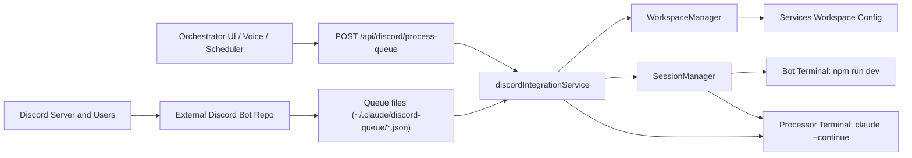
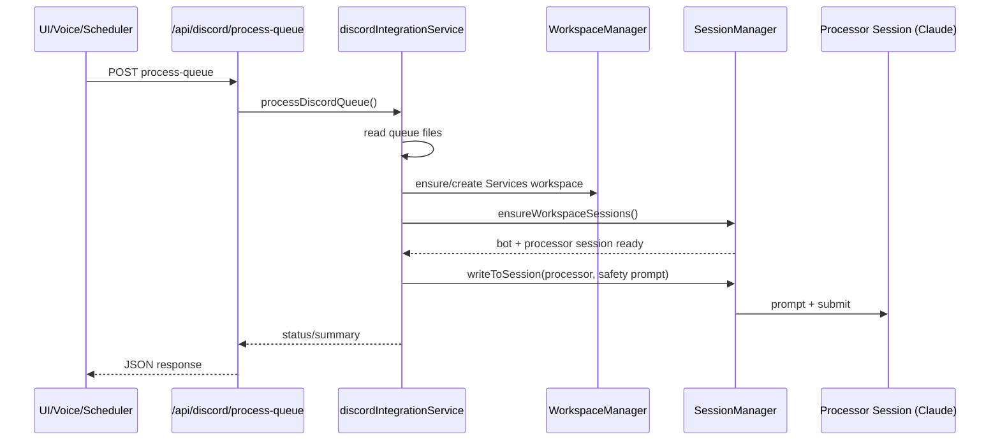

# Discord Bot Architecture, Risks, and Hardening Plan

## Scope
This document describes how the current Discord integration works in Claude Orchestrator, key risks in the current implementation, and practical improvements.

## Current Implementation (How It Works)

### Primary entry points
- `server/discordIntegrationService.js`
  - Builds/ensures the Services workspace (`buildServicesWorkspaceConfig`, `ensureDiscordServices`)
  - Reads queue status (`getDiscordStatus`)
  - Triggers queue processing by sending a guarded prompt to the processor terminal (`processDiscordQueue`)
- `server/index.js`
  - `GET /api/discord/status`
  - `POST /api/discord/ensure-services`
  - `POST /api/discord/process-queue`
  - Optional startup auto-ensure path via settings/env
- `server/commandRegistry.js` + `server/voiceCommandService.js`
  - Semantic/voice triggers for `discord-status`, `discord-ensure-services`, `discord-process-queue`
- `server/schedulerService.js`
  - Optional cadence template for queue processing (`discord-queue-cadence`)
- `client/dashboard.js` / `client/app.js` / `client/index.html`
  - UI actions and startup toggle for Discord Services

### Runtime model
- The orchestrator does **not** receive Discord webhooks directly.
- It expects queue files written by the external Discord bot repo under:
  - `~/.claude/discord-queue/pending-tasks.json`
  - `~/.claude/discord-queue/recent-messages.json`
- Processing flow:
  1. UI/voice/scheduler triggers `POST /api/discord/process-queue`
  2. Server ensures Services workspace + sessions exist
  3. Bot session runs in bot repo (`npm run dev`)
  4. Processor session runs Claude (`claude --continue --dangerously-skip-permissions`)
  5. Orchestrator sends a safety-oriented processing prompt to processor terminal

### Component diagram

### Sequence diagram (process queue)

## Current Risks

| Risk | Severity | Why it matters |
|---|---|---|
| Unauthenticated control path when `AUTH_TOKEN` is unset | High | If server is reachable, caller can hit `/api/discord/process-queue` and influence processor flow |
| Processor uses dangerous permissions mode | High | `claude --dangerously-skip-permissions` increases blast radius if prompt handling is compromised |
| Prompt-injection defense is advisory only | High | Safety text is guidance, not policy enforcement |
| Queue corruption can be silent | Medium | Invalid JSON can degrade to empty/zero-like states and hide ingestion failures |
| Re-entrant processing triggers | Medium | Rapid repeat triggers can stack prompts and create duplicate/conflicting work |
| Bot repo/path assumptions | Medium | Missing path or broken `npm run dev` can cause partial startup and ambiguous health |
| Session “running” heuristic may drift | Low/Med | PTY existence/status heuristics can misreport true liveness |

## Existing Protections
- Optional API auth via `AUTH_TOKEN`
- Bind-host guardrails to avoid insecure LAN exposure without auth
- Safety warning text in processor prompt to discourage unsafe execution
- Workspace/session orchestration centralized via existing manager services

## Recommended Protections (Pragmatic)

### Immediate (high value, low churn)
1. Require auth for `/api/discord/*` even if global auth is disabled (feature-specific token or policy gate).
2. Add a per-processor in-flight lock (`processing=true`) with TTL to prevent duplicate runs.
3. Validate queue JSON strictly and emit explicit health/error states (do not silently flatten to “no tasks”).
4. Add filesystem and repo-path preflight checks before launching bot session.
5. Add rate limiting for `/api/discord/process-queue`.

### Near term
1. Run processor in a reduced-permission mode by default; require explicit override for dangerous mode.
2. Add signed queue envelope format (HMAC) so orchestrator can verify queue producer authenticity.
3. Add per-task idempotency keys to avoid duplicate processing.
4. Add structured audit logs for every queue-processing invocation and outcome.

### Implemented hardening in this branch
1. Processor session defaults to `claude --continue`, with explicit dangerous-mode override support.
2. Signed queue verification added (`DISCORD_QUEUE_SIGNING_SECRET`, `DISCORD_REQUIRE_SIGNED_QUEUE`).
3. Queue and invocation idempotency added (task-level dedupe plus request-level replay via idempotency key).
4. JSONL audit logging added for queue processing outcomes.
5. Discord endpoints now support dedicated auth (`DISCORD_API_TOKEN`) with loopback-only fallback when no token is configured.
6. Queue processing endpoint rate limiting added to prevent repeated trigger spam.
7. Queue JSON parse failures now return explicit errors; empty queue runs are a no-op instead of dispatching unnecessary agent prompts.

### Longer term
1. Replace file-poll queue with a bounded broker/stream abstraction (Redis stream, NATS, or SQLite job table) with ack/retry/dead-letter support.
2. Move from prompt-only controls to policy-enforced tool allowlists for processor actions.
3. Add a dedicated “Discord worker” service account with least privilege and isolated runtime.

## Better Architecture (Proposed)

### Target model
- Discord bot publishes signed tasks to a durable job channel.
- Orchestrator ingests tasks through a single authenticated worker endpoint.
- Worker enforces:
  - schema validation
  - idempotency
  - authorization
  - bounded concurrency
  - execution policy
- Claude processor receives only normalized, policy-checked task payloads.

### Benefits
- Stronger trust boundaries
- Deterministic retries/visibility
- Better observability (queue depth, error rates, processing latency)
- Much lower risk of accidental arbitrary execution path

## Implementation Phases
1. API hardening + in-flight lock + explicit health states.
2. Signed queue payloads + idempotency keys + audit logs.
3. Durable queue backend + worker isolation + policy-enforced execution.
